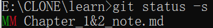
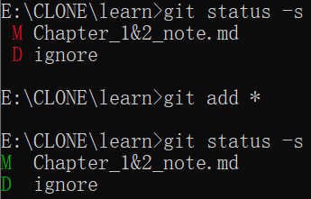
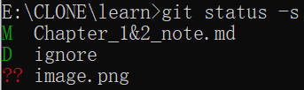

## Chapter 1
__Git是一个版本管理控制系统__
### 1.a 下载安装Git
Linux使用 
```bash 
sudo apt-get install git
```
Windows
前往https://git-scm.com/downloads 下载


### 1.b 初次运行Git的配置
当我们安装好Git后，需要在Git bash或者terminal进行作者和邮箱的设置
```bash
git config --global user.name "Your Name"
git config --global user.email "email@example.com"
```
_双引号可加可不加，好像Git新版本没加也是可以的_

__End of Chapter 1__

## Chapter 2

### 2.a 创建Git仓库
可以 __初始化现有文件夹来创建__
```shell
cd 文件夹 
git init
```
也可以 __克隆远程仓库创建__ (如GitHub上的repo) 
```shell
git clone <url>
```
_在尾部加入参数 __自定义本地文件夹名称__，而不会使用默认的远程仓库名_
```
git clone <url> 自定义本地文件夹名称
```


__Git 支持多种数据传输协议。__ 上面的例子使用的是 https:// 协议，不过你也可以使用 git:// 协议或者使用 SSH 传输协议，比如 user@server:path/to/repo.git 。 在服务器上搭建 Git 将会介绍所有这些协议在服务器端如何配置使用，以及各种方式之间的利弊

### 2.b 文件状态

```
git status
```
git status 命令的输出十分详细，但其用语有些繁琐。 Git 有一个选项可以帮你缩短状态命令的输出，这样可以以简洁的方式查看更改。 如果你使用 git status -s 命令或 git status --short 命令，你将得到一种格式更为紧凑的输出。
```
git status -s
git status --short
```
__简单看颜色就行__
- <font color=Red>红色</font>就是当前文件状态 __未同步__ 到暂存区
- <font color=Green>绿色</font>就是 __已同步__

<font color=Green>A</font> 文件已被跟踪，并且未修改，已经放入暂存区

<font color=Green>D</font> 对一个已经备份到git仓库中的文件，进行本地文件删除时，查看状态你就会看到绿色D

<font color=Red>M</font> 本地文件和git暂存区文件不一样，出现红色M

<font color=Green>M</font> 本地文件和git暂存区文件一样，出现绿色M

__其实这样解释不完全对，状态栏有两列，除去<font color=Red>??</font>状态
第一列是绿色状态栏，第二列是红色状态栏
<font color=Green>M</font><font color=Red>M</font>的状态表示前一次修改已经同步到暂存区，而当前修改并未同步__




<font color=Red>??</font>没有追踪该文件，需要```git add```追踪



#### 也就是凡是出现<font color=Red>红色</font>就要```git add```同步状态

### 2.c 各类操作
```
git add
git commit 
git commit -a -m
git remote
git clone
git push
git pull
git restore
git rm original_name new_name
git mv
git diff
```

### 2.d

### 2.e 忽略同步文件.gitignore
```
*.[oa]
*~
```
第一行告诉 Git 忽略所有以 .o 或 .a 结尾的文件。一般这类对象文件和存档文件都是编译过程中出现的。 第二行告诉 Git 忽略所有名字以波浪符（~）结尾的文件，许多文本编辑软件（比如 Emacs）都用这样的文件名保存副本。 此外，你可能还需要忽略 log，tmp 或者 pid 目录，以及自动生成的文档等等。 要养成一开始就为你的新仓库设置好 .gitignore 文件的习惯，以免将来误提交这类无用的文件。

文件 .gitignore 的格式规范如下：

所有空行或者以 # 开头的行都会被 Git 忽略。

可以使用标准的 glob 模式匹配，它会递归地应用在整个工作区中。

匹配模式可以以（/）开头防止递归。

匹配模式可以以（/）结尾指定目录。

要忽略指定模式以外的文件或目录，可以在模式前加上叹号（!）取反。

所谓的 glob 模式是指 shell 所使用的简化了的正则表达式。 星号（*）匹配零个或多个任意字符；[abc] 匹配任何一个列在方括号中的字符 （这个例子要么匹配一个 a，要么匹配一个 b，要么匹配一个 c）； 问号（?）只匹配一个任意字符；如果在方括号中使用短划线分隔两个字符， 表示所有在这两个字符范围内的都可以匹配（比如 [0-9] 表示匹配所有 0 到 9 的数字）。 使用两个星号（**）表示匹配任意中间目录，比如 a/**/z 可以匹配 a/z 、 a/b/z 或 a/b/c/z 等。

一个 .gitignore 文件的例子：
```shell

# 忽略所有的 .a 文件
*.a

# 但跟踪所有的 lib.a，即便你在前面忽略了 .a 文件
!lib.a

# 只忽略当前目录下的 TODO 文件，而不忽略 subdir/TODO
/TODO

# 忽略任何目录下名为 build 的文件夹
build/

# 忽略 doc/notes.txt，但不忽略 doc/server/arch.txt
doc/*.txt

# 忽略 doc/ 目录及其所有子目录下的 .pdf 文件
doc/**/*.pdf
  
```